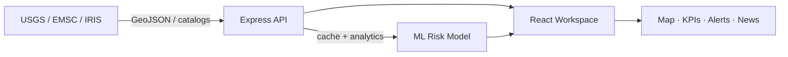

<div align="center">

  

  <br/>

  

  <br/><br/>

  <p>
    <b>Live earthquake intelligence</b> — maps, depth analytics, ML activity-risk nowcasting, and seismic news<br/>
    in a mobile-first React workspace powered by an Express API.
  </p>

  <p>
    <a href="https://github.com/Girisankarsm/quakepulse-Live_earthquake_tracker/actions/workflows/ci.yml"></a>
    
    
    
    
    
  </p>

  <p>
    <a href="#-quick-start"></a>
    <a href="#-api"></a>
    <a href="#-train-pattern-model"></a>
  </p>

</div>

---

## Why QuakePulse?

QuakePulse turns USGS (and multi-catalog) earthquake feeds into a polished **seismic intelligence workspace** — executive KPIs, clustered maps, depth profiles, threshold alerts, regional news, and a lightweight early-activity risk model.

<div align="center">
  
</div>

---

## Features

<table>
  <tr>
    <td width="50%">
      <h3>📡 Live pipeline</h3>
      USGS GeoJSON · 60s server cache · auto-refresh feed sync
    </td>
    <td width="50%">
      <h3>📱 Mobile-first UI</h3>
      Bottom nav · filter sheet · responsive desktop rail
    </td>
  </tr>
  <tr>
    <td>
      <h3>🗺️ Event map</h3>
      Leaflet clusters, magnitude styling, tap-for-detail markers
    </td>
    <td>
      <h3>📊 Depth & regions</h3>
      Bin profiles, scatter, crustal vs deep insights
    </td>
  </tr>
  <tr>
    <td>
      <h3>🧠 Pattern predict</h3>
      Logistic early-activity risk · regional forecasts · k-means clusters
    </td>
    <td>
      <h3>🔔 Alerts & news</h3>
      Threshold monitor · USGS / GDACS / Google News coverage
    </td>
  </tr>
  <tr>
    <td>
      <h3>📁 Data registry</h3>
      Browse filtered events · one-click CSV export
    </td>
    <td>
      <h3>🛡️ Resilient API</h3>
      Timeouts · rate limits · typed errors
    </td>
  </tr>
</table>

**Workspace pages:** Overview · Map · Analytics · Predict · Alerts · News · Data

---

## Architecture

```text
quakepulse/
├── client/                 # React + Vite + Leaflet + Recharts
├── server/                 # Express intelligence API
│   └── src/
│       ├── routes/         # earthquakes · news · ml · meta
│       ├── services/       # usgs · analytics · ml · news · datasets
│       └── middleware/     # rate limit · errors
├── docs/assets/            # Animated README visuals
└── .github/workflows/      # CI
```



---

## Quick Start

```bash
npm install
npm run dev
```

| Service | URL |
|---------|-----|
| Client | http://localhost:5173 |
| API | http://localhost:3001 |

**Production**

```bash
npm run build
npm start
```

---

## Train pattern model

```bash
# From live USGS feed
npm run train -- --feed week

# Multi-catalog download (USGS · EMSC · IRIS)
npm run train -- --days 30 --min-mag 2.5
```

```bash
npm test
```

---

## API

| Endpoint | Description |
|----------|-------------|
| `GET /api/health` | Health check |
| `GET /api/earthquakes/summary` | KPIs + overview series |
| `GET /api/earthquakes` | Filtered event list |
| `GET /api/earthquakes/analytics` | Depth, regions, ML patterns |
| `GET /api/earthquakes/alerts` | Threshold alerts |
| `GET /api/news` | Seismic news (`?region=`) |
| `GET /api/ml/model` | Persisted model metadata |
| `GET /api/ml/patterns` | Pattern + risk analysis |
| `GET /api/ml/predict` | Near-term regional risk forecast |

Query params (earthquakes): `period`, `minMagnitude`, `maxDepth`, `place`, `alertThreshold`.

---

## Tech Stack

| Layer | Stack |
|-------|-------|
| Frontend | React 19 · Vite · Leaflet · Recharts |
| Backend | Node.js · Express · node-cache · rss-parser |
| ML | Pure-JS logistic early-activity risk + k-means (no paid APIs) |
| Sources | [USGS](https://earthquake.usgs.gov/fdsnws/event/1/) · EMSC · IRIS |

---

## Disclaimer

For informational and analytical purposes only. Not intended for operational emergency response. The ML module nowcasts elevated short-horizon activity risk — it does **not** predict exact earthquake timing or location.

---

<div align="center">

  

  <br/>

  <sub>Built for calm, clear seismic situational awareness · MIT License</sub>

</div>
